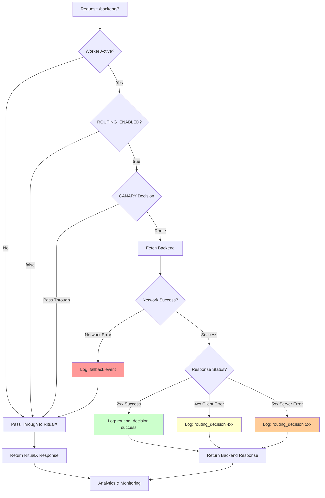

## Project Overview

This is a Cloudflare Worker project named "routing-backend" that serves as an HTTP proxy router. The worker intercepts requests to `ritualx-dev.ritual-app.co` and routes `/backend/*` paths to `management-dev.ritual-app.co` while preserving all other request properties.

## Development Commands

**Development & Testing**:
```bash
npm run dev          # Start local development server
npm run start        # Alias for dev
npm test             # Run tests with Vitest
npm run cf-typegen   # Generate Cloudflare Worker types
```

**Deployment**:
```bash
npm run deploy:dev   # Deploy to dev environment (routing-backend-dev)
npm run deploy:prod  # Deploy to production (routing-backend)

# Direct wrangler commands
CLOUDFLARE_ACCOUNT_ID=19c2ad706ef9998b3c6d9a2acc68a1fd wrangler deploy --env dev
CLOUDFLARE_ACCOUNT_ID=19c2ad706ef9998b3c6d9a2acc68a1fd wrangler deploy --env production
```

**✅ Latest Deployment Status**:
- **Worker**: `routing-backend-dev` 
- **Version ID**: `d120a289-a510-4885-ad3e-bde74941e28d`
- **Deployed**: 2025-06-30 (Enhanced logging active)
- **Routes**: `ritualx-dev.ritual-app.co/backend/*` and `/worker-health`

## Architecture

### Core Components

**src/index.ts**: Main worker entry point with fetch handler
- Implements hostname-based routing logic
- Proxies `/backend/*` requests to management service
- Preserves HTTP method, headers, and body in proxied requests

### Routing Logic

The worker implements selective path-based routing:

**Routes that get proxied** (removes `/backend` prefix):
- `https://ritualx-dev.ritual-app.co/backend/v1/experts/` → `https://management-dev.ritual-app.co/v1/experts/`
- `https://ritualx-dev.ritual-app.co/backend/*` → `https://management-dev.ritual-app.co/*`

**Routes that pass through unchanged**:
- `https://ritualx-dev.ritual-app.co/v1/experts/` → unchanged (no `/backend` prefix)
- All other paths on the domain
- All other hostnames

### Configuration

**wrangler.toml/wrangler.jsonc**: Cloudflare Worker configuration
- Routes configured for dev environment only
- Production routes are commented out to prevent accidental deployments
- Development uses `ritualx-dev.ritual-app.co`

### Testing

**test/index.spec.ts**: Vitest tests using Cloudflare Workers test utilities
- Unit tests with mocked execution context
- Integration tests using SELF.fetch()
- Currently contains placeholder tests that need updating

**vitest.config.mts**: Test configuration
- Uses `@cloudflare/vitest-pool-workers` for Worker-specific testing
- References `wrangler.jsonc` for test environment setup

## Important Notes

- The main entry point in package.json points to `src/index.js` but the actual source is TypeScript
- Tests are currently placeholder "Hello World" tests and should be updated to test actual routing logic
- Worker runs in Cloudflare's edge environment with specific runtime limitations
- TypeScript configuration excludes test files from compilation
- Production deployment is intentionally disabled to prevent mistakes

## Production Status: ✅ ACTIVE & WORKING

**Routing**: `ritualx-dev.ritual-app.co/backend/*` → `management-dev.ritual-app.co/*`  
**Environment**: `ROUTING_ENABLED=true`, `CANARY_PERCENT=50` (tested & verified)  
**Account**: `19c2ad706ef9998b3c6d9a2acc68a1fd` | **Worker**: `routing-backend`

### Essential Commands
```bash
# Health check (critical alert)
curl -f https://ritualx-dev.ritual-app.co/worker-health

# Deploy
CLOUDFLARE_ACCOUNT_ID=19c2ad706ef9998b3c6d9a2acc68a1fd wrangler deploy

# Emergency disable
echo "false" | CLOUDFLARE_ACCOUNT_ID=19c2ad706ef9998b3c6d9a2acc68a1fd wrangler secret put ROUTING_ENABLED --env=""
```

## Error Handling & Monitoring

### Error Flow Diagram



### Current Error Handling Behavior

| Error Type | Status Code | Current Behavior | Monitoring |
|------------|-------------|------------------|------------|
| **Network Failure** | N/A | ✅ Auto-fallback to RitualX | ✅ Logged as 'fallback' event |
| **Client Errors** | 4xx | ⚠️ Pass through to user | ✅ Logged with status code |
| **Server Errors** | 5xx | ⚠️ Pass through to user | ✅ Logged with status code |
| **Success** | 2xx | ✅ Return backend response | ✅ Logged with timing |

### What This Means

**✅ Network Protection**: If Django backend is unreachable, users get RitualX frontend (graceful degradation)

**⚠️ Error Pass-Through**: 4xx/5xx errors from Django are returned to users as-is

**📊 Full Monitoring**: All responses and errors are logged for analysis

### Critical Monitoring Queries

**4xx Error Rate (Client Errors)**:
```sql
-- Analytics Engine Query
SELECT 
  COUNT(*) as total_4xx,
  COUNT(*) * 100.0 / (SELECT COUNT(*) FROM routing_metrics WHERE routed = true) as error_rate_percent
FROM routing_metrics 
WHERE response_status >= 400 AND response_status < 500
  AND routed = true
  AND timestamp > datetime('now', '-5 minutes')
```

**5xx Error Rate (Server Errors)**:
```sql
-- Analytics Engine Query  
SELECT 
  COUNT(*) as total_5xx,
  COUNT(*) * 100.0 / (SELECT COUNT(*) FROM routing_metrics WHERE routed = true) as error_rate_percent
FROM routing_metrics 
WHERE response_status >= 500
  AND routed = true
  AND timestamp > datetime('now', '-5 minutes')
```

**Fallback Rate (Network Failures)**:
```sql
-- Analytics Engine Query (use routing_metrics_dev for dev environment)
SELECT COUNT(*) as fallback_count
FROM routing_metrics_dev
WHERE event_type = 'fallback'
  AND timestamp > datetime('now', '-5 minutes')
```

### Recommended Alerts

| Alert Type | Threshold | Action |
|------------|-----------|--------|
| **5xx Error Rate** | > 5% in 5 min | 🚨 Page immediately |
| **4xx Error Rate** | > 20% in 5 min | ⚠️ Investigate |
| **Fallback Rate** | > 10% in 5 min | 🔥 Critical - Backend down |
| **Response Time** | > 5s average | ⚠️ Performance issue |

## CANARY Rollout Control

### Overview
The worker implements a canary rollout mechanism that allows gradual traffic migration from the original destination to the new backend routing.

### Environment Variables
- **`CANARY_PERCENT`**: Percentage of `/backend/*` requests to route to management-dev (0-100)
  - `0`: No routing - all `/backend/*` requests pass through to original destination
  - `50`: 50% of `/backend/*` requests route to management-dev, 50% pass through
  - `100`: All `/backend/*` requests route to management-dev (full migration)

### How It Works
```typescript
const canaryPercent = parseInt(env?.CANARY_PERCENT || "100");
const shouldRoute = Math.random() * 100 < canaryPercent;

if (!shouldRoute) {
  // Pass through to original destination (RitualX frontend)
  return fetch(request);
}
// Route to management-dev backend
```

### Usage Examples
```bash
# Start with 0% routing (no impact)
CANARY_PERCENT=0

# Gradually increase routing
CANARY_PERCENT=10  # 10% of traffic
CANARY_PERCENT=50  # 50% of traffic  
CANARY_PERCENT=100 # Full migration
```

### Monitoring Canary Status
```bash
curl https://ritualx-dev.ritual-app.co/worker-health
# Returns: {"canary_percent": 50, "routing_enabled": true, ...}
```

### Canary Safety
- Each request is independently evaluated (stateless)
- Failed routing attempts automatically fall back to original destination
- `ROUTING_ENABLED=false` overrides canary and disables all routing
- Health check endpoint always works regardless of canary settings

## Critical Monitoring & Alerting

### Analytics Engine Integration
The worker uses Cloudflare Analytics Engine to collect comprehensive metrics:

```typescript
// Metrics collected for every request
{
  event_type: 'routing_decision' | 'health_check' | 'error' | 'fallback',
  routed: boolean,
  response_status: number,
  response_time_ms: number,
  canary_percent: number,
  error_message?: string
}
```

### Enhanced Health Endpoint
```bash
curl https://ritualx-dev.ritual-app.co/worker-health
# Returns:
{
  "status": "healthy",
  "routing_enabled": true,
  "canary_percent": 0,
  "backend_healthy": true,
  "backend_response_time_ms": 45,
  "worker_response_time_ms": 67,
  "timestamp": "2025-06-26T08:55:42.799Z"
}
```

### Most Critical Alerts Only
- **Worker Health Check Failures**: CRITICAL - System down
- **Backend Response Time > 5s**: HIGH - Performance issue

### Environment Variable Control

**Current Status**: ✅ Variables properly configured
- `ROUTING_ENABLED=true`  
- `CANARY_PERCENT=0` (safe start - no routing impact)

**Check Configuration**:
```bash
# List environment variables
CLOUDFLARE_ACCOUNT_ID=19c2ad706ef9998b3c6d9a2acc68a1fd wrangler secret list

# Check worker status
curl -s https://ritualx-dev.ritual-app.co/worker-health
```

**Traffic Control (Simple)**:
```bash
# Change canary percentage (npm commands)
npm run canary:0    # 0% to Django (safe)
npm run canary:50   # 50% to Django 
npm run canary:100  # 100% to Django (full routing)

# Test current distribution (with pass/fail)
npm run canary:test

# Deploy to production
npm run deploy:prod
```

**Manual Control (Advanced)**:
```bash
# Direct wrangler commands
echo "0" | CLOUDFLARE_ACCOUNT_ID=19c2ad706ef9998b3c6d9a2acc68a1fd wrangler secret put CANARY_PERCENT --env=""
echo "50" | CLOUDFLARE_ACCOUNT_ID=19c2ad706ef9998b3c6d9a2acc68a1fd wrangler secret put CANARY_PERCENT --env=""
echo "100" | CLOUDFLARE_ACCOUNT_ID=19c2ad706ef9998b3c6d9a2acc68a1fd wrangler secret put CANARY_PERCENT --env=""
```

**For detailed monitoring setup**: See `.ai_docs/monitoring_guide.md`

### Pending Tasks
- [ ] Write comprehensive routing tests (test/index.spec.ts)
- [ ] Clean up configuration (remove wrangler.jsonc, fix package.json main entry)
- [ ] Add circuit breaker pattern for automatic failure recovery
- [ ] Deploy and test live routing behavior

## AI Documentation

**Important**: This project has comprehensive AI documentation in `.ai_docs/` directory:

- **`.ai_docs/project_overview.md`** - Complete project status, architecture, and configuration
- **`.ai_docs/migration_plan.md`** - Step-by-step DNS migration plan with timelines
- **`.ai_docs/troubleshooting_guide.md`** - Common issues and emergency procedures  
- **`.ai_docs/session_history.md`** - Detailed session history and decisions made

**For Claude Code**: Always read the `.ai_docs/` files to understand:
- Current project status and what's been implemented
- Why specific decisions were made
- What the next steps should be
- How to troubleshoot issues
- Emergency rollback procedures

This documentation preserves context across sessions and ensures continuity.

## Memory

### Enhanced Observability Implementation (2025-06-30)
- **Analytics Engine Enhancement**: Added comprehensive request source tracking with client IPs, referrers, data center locations (cf_colo), ASN data, and route categorization
- **Route Categorization**: Implemented `categorizeRoute()` function to classify requests (experts-api, api-v1, health-check, backend-other, worker-health, frontend)
- **Unique Request Tracking**: Added `request_id` using `crypto.randomUUID()` for request tracing
- **Enhanced Metrics Interface**: Extended `RoutingMetrics` with `client_ip`, `referer`, `cf_colo`, `cf_asn`, `route_category`, `request_id` fields

### CLI Analytics Dashboard System
- **Live Dashboard Script**: Created `create-dashboard.sh` with real-time analytics display
- **Environment Configuration**: Proper dev/prod environment switching using `ENV_PROFILE` variable
- **Security**: Environment variables secured in `.env` file with `.env.example` template
- **Analytics QL Queries**: Complete set of dashboard queries for routing decisions, canary performance, geographic distribution, error monitoring
- **npm Scripts**: Added `dashboard`, `dashboard:dev`, `dashboard:prod` commands for easy access
- **Auto-refresh**: 30-second refresh cycle with colored terminal output

### Key Features Implemented
1. **Request Source Tracking**: Full visibility into request origins, referrers, and client details
2. **Route Performance Analysis**: Categorized performance metrics by route type
3. **Geographic Distribution**: Country and data center performance tracking  
4. **Error Monitoring**: Comprehensive 4xx/5xx error tracking with status codes
5. **Live Monitoring**: Real-time CLI dashboard with automatic refresh
6. **Environment Switching**: Seamless dev/prod dataset switching

## Enhanced Logging & Monitoring

### Live Request Tracking
The worker now provides comprehensive console logging for every request:

**Log Format**:
```
ROUTING: CF-Ray | Client-IP | Path → BACKEND | Status | Time | Country
PASSTHROUGH: CF-Ray | Client-IP | Path → FRONTEND | Country  
FALLBACK: CF-Ray | Client-IP | Path → FRONTEND | ERROR: message
```

**View Logs**:
```bash
# Live tail in terminal
CLOUDFLARE_ACCOUNT_ID=19c2ad706ef9998b3c6d9a2acc68a1fd wrangler tail routing-backend-dev

# Or view in Cloudflare Dashboard
# Go to: Workers & Pages → routing-backend-dev → Logs
```

### Analytics QL Queries

**Request Volume by Route Category**:
```sql
SELECT route_category, COUNT(*) as request_count
FROM routing_metrics_dev 
WHERE timestamp > datetime('now', '-1 hour')
GROUP BY route_category
ORDER BY request_count DESC
```

**Error Rate Analysis**:
```sql
SELECT 
  response_status,
  COUNT(*) as error_count,
  AVG(response_time_ms) as avg_response_time
FROM routing_metrics_dev 
WHERE response_status >= 400 
  AND timestamp > datetime('now', '-1 hour')
GROUP BY response_status
ORDER BY error_count DESC
```

**Geographic Traffic Distribution**:
```sql
SELECT 
  cf_country,
  cf_colo,
  COUNT(*) as request_count,
  AVG(response_time_ms) as avg_response_time
FROM routing_metrics_dev 
WHERE timestamp > datetime('now', '-1 hour')
GROUP BY cf_country, cf_colo
ORDER BY request_count DESC
LIMIT 10
```

**Routing vs Pass-through Analysis**:
```sql
SELECT 
  routed,
  COUNT(*) as request_count,
  AVG(response_time_ms) as avg_response_time,
  COUNT(*) * 100.0 / (SELECT COUNT(*) FROM routing_metrics_dev WHERE timestamp > datetime('now', '-1 hour')) as percentage
FROM routing_metrics_dev 
WHERE timestamp > datetime('now', '-1 hour')
GROUP BY routed
```

### Files Modified/Created
- `src/index.ts`: Enhanced analytics collection with new metrics fields
- `create-dashboard.sh`: CLI dashboard script with Analytics QL queries
- `.env.example`: Environment configuration template
- `package.json`: Added dashboard npm scripts
- `analytics-dashboard.md`: Complete Analytics QL query reference

### Security Improvements
- Removed hardcoded `CLOUDFLARE_ACCOUNT_ID` from package.json scripts
- Environment variables properly secured in `.env` (gitignored)
- Maintained `CLOUDFLARE_ACCOUNT_ID` variable name for consistency with existing workflows
